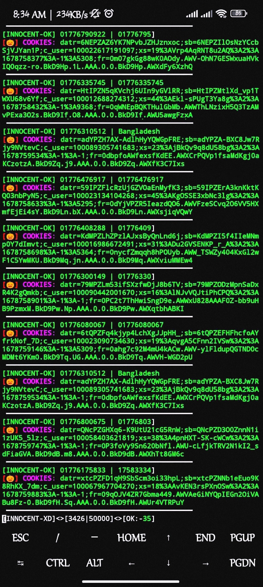

## COMMAND :

* `pkg update && pkg upgrade`

* `pkg install python`

* `pkg install git`

* `pip install requests`

* `pip install mechanize`

* `pip install futures`

* `pip install rich`

* `pip install bs4`

* `rm -rf GREEN-FIRE`

* `git clone https://github.com/MUMIT-404-CYBER/GREEN-FIRE.git`

* `cd GREEN-FIRE`

* `python fire.py`

___This Tool is Free Enjoy Dear User.___ 

## SCREENSHOT :
 

